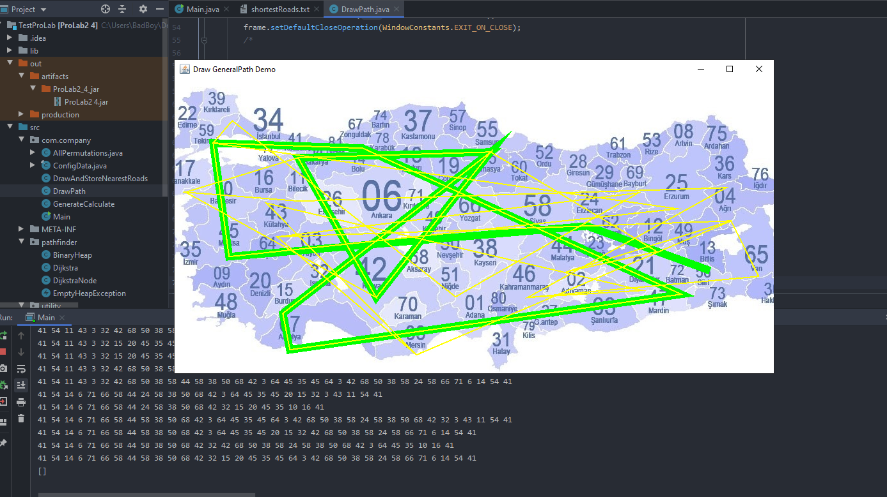

# ShortestPath
Finding the shortest paths among cities in Java. Using node combination based on Dijkstra algorithm.
Implemented an 81 cities (Used Turkey map), and there is an additional starting and end city points to travel from. The algorithm will draw you a shorter road to visit cities and come back.

## Example output

